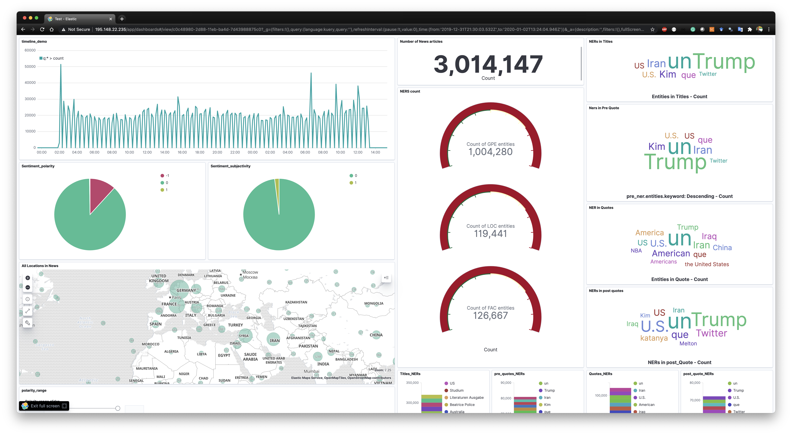
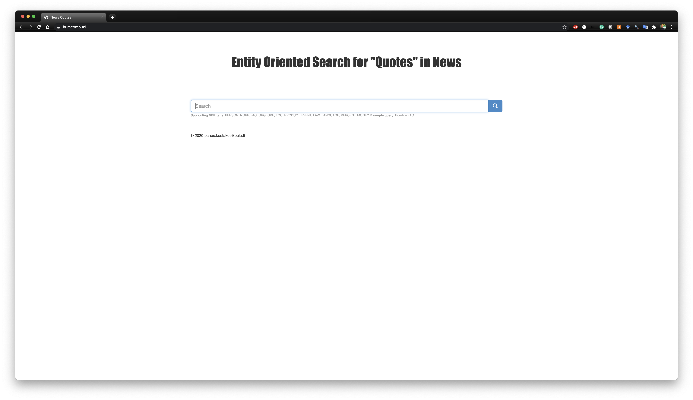

# Code for the "Strings and Things" paper. 

Here you can find the source code for the paper "Strings and Things: A Semantic Search Engine for news quotes using Named Entity Recognition". A live demo is also available in this link https://www.humcomp.ml/. 

Below you can also see some cool aggregations and visualizations in Kibana that was done by Abhinay Pandya for the 2020 #WaterFrontHack Global Online Hackathon organised by the H2020 CUTLER project. You can also check his pitch video here: https://www.youtube.com/watch?v=IiJXlneg6HM

The cluster is hosted in the CSC cPouta infra. 

  

  

  

